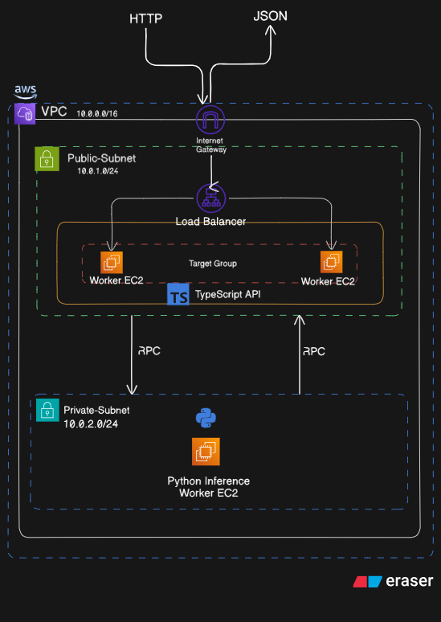
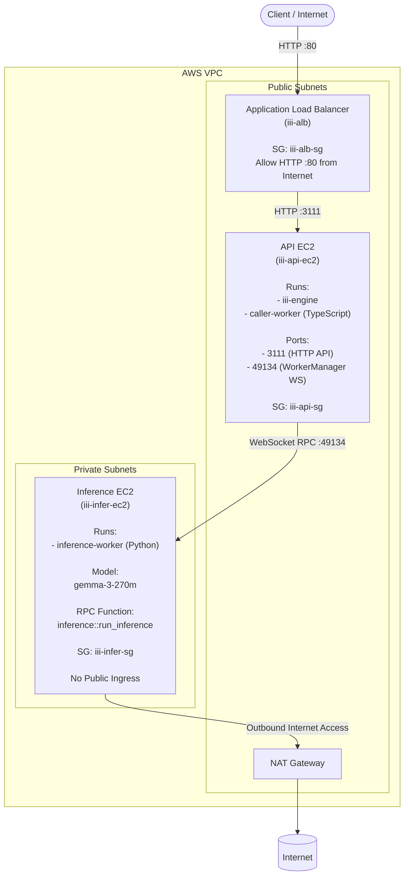

# Alchemyst-devops-assignment
## Distributed Inferencing on AWS — `iii` Quickstart

This is my devops internship assignment for Alchemyst AI. I took the
`iii` quickstart and split the workers across two EC2s, then exposed a JSON
HTTP API through an ALB. It is not a huge system, but it shows the full
chain working: HTTP -> RPC -> inference -> back to HTTP.

One `terraform apply` creates the VPC, subnets, ALB, EC2s, and the systemd
services. The interesting part for me was making the workers talk over the
VPC and dealing with first-boot automation issues.

---

## Table of contents

1. [Example API Request](#example-api-request)
2. [Architecture](#architecture)
3. [Repository layout](#repository-layout)
4. [Prerequisites](#prerequisites)
5. [Deploy with Terraform](#deploy-with-terraform)
6. [Configuration variables](#configuration-variables)
7. [Test the API](#test-the-api)
8. [Operations and debugging](#operations-and-debugging)
9. [Destroy and re-deploy](#destroy-and-re-deploy)
10. [Manual deployment (alternative path)](#manual-deployment-alternative-path)
11. [Changes vs the upstream `quickstart`](#changes-vs-the-upstream-quickstart)
12. [What's intentionally kept simple](#whats-intentionally-kept-simple)
13. [Known limitations](#known-limitations)
14. [Submission details](#submission-details)

---

## Example API Request

```bash
curl -X POST "$(terraform -chdir=terraform output -raw api_url)" \
  -H 'Content-Type: application/json' \
  -d '{"messages":[{"role":"user","content":"hi"}]}'
```

Sample response (truncated):

```json
{
  "result": {
    "0": "h", "1": "i", "2": "-", "3": "d", "...": "...",
    "success": "You've connected two workers and they're interoperating seamlessly, now let's add a few more workers to expand this project's functionality."
  }
}
```

> The `"0":"h","1":"i",...` shape is a known quirk: the Python worker returns a
> string and the TypeScript caller spreads it before returning, which turns
> each character into a numbered key. The end-to-end RPC + JSON path is what
> the assignment evaluates; fixing the shape is a one-line change in
> `caller-worker` noted under *Known limitations*.

---

## Architecture

My goal was to keep only the API edge public and keep inference private. The
API EC2 has the `iii` engine and the TypeScript caller-worker. The Python
inference worker sits in a private subnet and only talks over the VPC.

### Diagram




Request flow:

1. Client `POST /v1/chat/completions` to ALB.
2. ALB forwards to API EC2 `:3111`.
3. `iii-http` trigger dispatches to `http::run_inference_over_http`
  (TypeScript caller-worker).
4. Caller-worker invokes `inference::get_response` → `inference::run_inference`
  over WebSocket to the engine.
5. Engine forwards the call to the Python inference-worker on the private
  inference EC2.
6. Python decodes with `transformers`, returns the string. Caller-worker
  wraps it, engine returns JSON to ALB to client.

Why the public/private split:

- The API is the only thing that needs to face the internet, so it sits in a
  public subnet behind the ALB.
- The inference worker should not be publicly reachable. Putting it in a
  private subnet means no inbound internet access at all, only VPC traffic.
- The only open path to inference is the RPC call over the VPC. This keeps
  the blast radius small and makes it obvious where traffic is allowed.

### Worker roles


| Worker             | Language   | Function                                                                                                        | Runs on                        |
| ------------------ | ---------- | --------------------------------------------------------------------------------------------------------------- | ------------------------------ |
| `inference-worker` | Python     | `inference::run_inference` — loads `gemma-3-270m` (GGUF, Q8), applies the chat template, returns decoded output | Inference EC2 (private subnet) |
| `caller-worker`    | TypeScript | `inference::get_response` — calls `inference::run_inference` with the user payload                              | API EC2 (public subnet)        |
| `caller-worker`    | TypeScript | `http::run_inference_over_http` — HTTP trigger bound to `POST /v1/chat/completions`                             | API EC2 (public subnet)        |


For framework details see [https://iii.dev/docs/](https://iii.dev/docs/).

---

## Repository layout

```text
quickstart/
├── README.md                       <- you are here
├── config.yaml                     <- iii engine config (HTTP, queue, state)
├── body.json                       <- sample request body for curl tests
├── iii.worker.yaml                 <- engine project manifest
├── workers/
│   ├── caller-worker/              <- TypeScript: HTTP -> RPC
│   │   ├── src/worker.ts
│   │   ├── iii.worker.yaml
│   │   └── package.json
│   └── inference-worker/           <- Python: model + RPC handler
│       ├── inference_worker.py
│       ├── iii.worker.yaml
│       └── requirements.txt
└── terraform/                      <- Infrastructure as code
    ├── versions.tf                 <- provider versions + default tags
    ├── main.tf                     <- AMI lookup, AZ data, locals
    ├── variables.tf                <- all inputs
    ├── outputs.tf                  <- alb_dns_name, instance IDs, sample_curl
    ├── vpc.tf                      <- VPC, subnets, IGW, NAT, route tables
    ├── security_groups.tf          <- alb-sg, api-sg, infer-sg with VPC-scoped rules
    ├── iam.tf                      <- SSM instance profile
    ├── ec2.tf                      <- both EC2 instances + user-data rendering
    ├── alb.tf                      <- ALB, target group, listener
    ├── terraform.tfvars.example
    ├── .gitignore                  <- excludes .terraform/, *.tfstate, *.tfvars
    └── user_data/
        ├── api.sh.tftpl            <- bootstraps engine + caller-worker as systemd
        └── infer.sh.tftpl          <- bootstraps Python worker as systemd
```

---

## Prerequisites

- An AWS account.
- AWS credentials available to Terraform (`aws configure` or `AWS_*` env vars).
- Terraform `>= 1.5`.
- ~5 minutes for AWS resources, plus ~10 minutes inside the VMs for
`apt-get` / `npm install` / `pip install` / first model download.

Permissions needed (per `terraform apply`): create/destroy VPC, subnets,
route tables, NAT, IGW, EIP, security groups, IAM role + instance profile,
EC2 instances, ALB + target group + listener.

---

## Deploy with Terraform

This is the **single-command** path. It builds the full stack on a clean
AWS account without clicking around in the console.

```bash
git clone https://github.com/KUMARNiru007/alchemyst-devops-assignment.git
cd alchemyst-devops-assignment/quickstart/terraform

cp terraform.tfvars.example terraform.tfvars   # edit if needed
terraform init
terraform apply -auto-approve
```

Outputs include the public URL:

```text
api_url           = "http://iii-alb-xxxxxxxx.ap-south-1.elb.amazonaws.com/v1/chat/completions"
sample_curl       = "curl -X POST http://... -H 'Content-Type: application/json' -d '...'"
api_instance_id   = "i-..."        # for SSM Session Manager
infer_instance_id = "i-..."        # for SSM Session Manager
api_private_ip    = "10.0.x.x"
infer_private_ip  = "10.0.x.x"
```

What `terraform apply` provisions:

- VPC `10.0.0.0/16` with two public subnets (`10.0.0.0/20`, `10.0.16.0/20`)
and two private subnets (`10.0.128.0/20`, `10.0.144.0/20`) across two AZs.
- An Internet Gateway + a single NAT Gateway (in the first public subnet).
- Route tables: public → IGW, private → NAT.
- Three security groups:
  - `iii-alb-sg` — only HTTP/80 from the internet.
  - `iii-api-sg` — only `:3111` from `iii-alb-sg` and `:49134` from
  `iii-infer-sg`. SSH is opt-in (see `ssh_key_name`).
  - `iii-infer-sg` — no public ingress.
- IAM role + instance profile with `AmazonSSMManagedInstanceCore` so both
VMs are reachable over **SSM Session Manager** without SSH keys.
- An **API EC2** (public subnet) running the `iii` engine and the TypeScript
  `caller-worker` as `systemd` services (`iii-engine.service`,
  `iii-caller.service`).
- An **Inference EC2** (private subnet, no public IP) running the Python
  `inference-worker` as `iii-inference.service`, with `III_URL` rendered
  to the API EC2's private IP at apply time.
- An **Application Load Balancer** (the only public entry point) with an
HTTP/80 listener forwarding to a target group on `:3111`.

---

## Configuration variables

All defaults are in `terraform/variables.tf`. Override in
`terraform.tfvars` only when you need to.


| Variable               | Default                             | Notes                                            |
| ---------------------- | ----------------------------------- | ------------------------------------------------ |
| `aws_region`           | `ap-south-1`                        | Match your account.                              |
| `project_name`         | `iii`                               | Prefix on every resource and tag.                |
| `vpc_cidr`             | `10.0.0.0/16`                       |                                                  |
| `public_subnet_cidrs`  | `["10.0.0.0/20","10.0.16.0/20"]`    | Two AZs.                                         |
| `private_subnet_cidrs` | `["10.0.128.0/20","10.0.144.0/20"]` | Two AZs.                                         |
| `api_instance_type`    | `t3.small`                          | Engine + Node + tsx.                             |
| `infer_instance_type`  | `m7i-flex.large`                         | CPU-only inference; bump for speed.              |
| `infer_root_volume_gb` | `20`                                | Model + venv + torch ~ 3-4 GB.                   |
| `ssh_key_name`         | `""`                                | Set to existing key pair name to enable SSH.     |
| `admin_ssh_cidr`       | `0.0.0.0/0`                         | Restrict to your `x.x.x.x/32` if you enable SSH. |
| `alb_ingress_cidr`     | `0.0.0.0/0`                         | Restrict for a private demo.                     |
| `git_repo_url`         | this repo                           | If you fork, override here.                      |
| `git_branch`           | `main`                              |                                                  |
| `engine_http_port`     | `3111`                              | Must match `iii-http.port` in `config.yaml`.     |
| `engine_worker_port`   | `49134`                             | iii WorkerManager port (default).                |


---

## Test the API

```bash
curl -X POST "$(terraform -chdir=terraform output -raw api_url)" \
  -H 'Content-Type: application/json' \
  -d '{"messages":[{"role":"user","content":"hi"}]}'
```

The model (`gemma-3-270m-Q8_0.gguf`, ~270 MB) is pre-downloaded into the
HuggingFace cache during cloud-init, **before** the inference systemd
service starts. So once `cloud-init` reports finished and the ALB target
is healthy, the first request is fast. If you do test before bootstrap is
done, you'll either get `502 Bad Gateway` (engine not ready) or
`Function inference::run_inference not found` (worker still installing
deps / pulling the model) — wait for `iii-bootstrap.log` to print
`Inference bootstrap finished` and try again.

You can also follow the rendered sample command:

```bash
terraform -chdir=terraform output -raw sample_curl
```

---

## Operations and debugging

Both VMs are reachable through SSM Session Manager — no SSH key required.

```bash
# API EC2 (engine + caller)
aws ssm start-session --target $(terraform -chdir=terraform output -raw api_instance_id)
sudo journalctl -u iii-engine -f
sudo journalctl -u iii-caller -f

# Inference EC2 (private subnet)
aws ssm start-session --target $(terraform -chdir=terraform output -raw infer_instance_id)
sudo journalctl -u iii-inference -f
```

Watching first-boot progress (apt / npm / pip / model pull):

```bash
sudo tail -f /var/log/cloud-init-output.log
```

Quick health checks on the API EC2:

```bash
# Engine answers 404 on `/` (still healthy for ALB)
curl -s -o /dev/null -w "HTTP %{http_code}\n" http://127.0.0.1:3111/

# Listening sockets
ss -ltnp | grep -E '3111|49134'

# Service state
systemctl status iii-engine iii-caller
```

The target group health (EC2 -> Target Groups -> `iii-api-tg`) must show
**healthy** before the ALB will route requests. Health checks expect a
response on `GET /` from the engine; `200-499` is treated as healthy.

---

## Destroy and re-deploy

```bash
cd terraform
terraform destroy -auto-approve
```

Tears down everything: ALB, EC2s, NAT, EIP, subnets, SGs, IAM. No orphan
resources are left behind.

Re-applying produces an **identical stack** without any manual fix-up. A
few things change by design:


| Item                              | Stable across re-deploys? | Notes                                                                                                                          |
| --------------------------------- | ------------------------- | ------------------------------------------------------------------------------------------------------------------------------ |
| VPC / subnet CIDRs                | Yes                       | From `variables.tf`.                                                                                                           |
| Security group structure          | Yes                       | Same names and rules; new IDs.                                                                                                 |
| IAM role / instance profile names | Yes                       | Hardcoded.                                                                                                                     |
| ALB DNS name                      | **No**                    | AWS generates a new DNS for every new ALB. Use `terraform output api_url` to get the current one.                              |
| EC2 IPs                           | **No**                    | New IPs each time. **Self-heals**: the inference EC2's `III_URL` is rendered from `aws_instance.api.private_ip` at apply time. |
| Model on disk                     | **No**                    | Re-downloaded from HuggingFace during cloud-init (pre-warm step), so it's ready before the first request lands.                |
| Engine + worker startup           | Yes                       | `systemd` brings them up automatically; no `tmux`, no manual restart.                                                          |
| Worker registration               | Yes                       | `inference-worker` self-registers via `register_worker(III_URL, ...)`.                                                         |


Post-redeploy checklist:

```bash
# 1. Apply
cd terraform && terraform apply -auto-approve

# 2. Wait ~10 minutes for user-data to finish
aws ssm start-session --target $(terraform -chdir=terraform output -raw api_instance_id)
sudo tail -f /var/log/cloud-init-output.log

# 3. Test
curl -X POST "$(terraform -chdir=terraform output -raw api_url)" \
  -H 'Content-Type: application/json' \
  -d '{"messages":[{"role":"user","content":"hi"}]}'
```

After a clean redeploy I still do a quick check, but it should come up without
manual edits.

If the test fails:


| Symptom                                       | Likely cause                              | Fix                                                                |
| --------------------------------------------- | ----------------------------------------- | ------------------------------------------------------------------ |
| `502 Bad Gateway`                             | user-data still installing                | Wait; check `cloud-init-output.log`.                               |
| `Connection timed out`                        | SG not propagated yet                     | Wait 30s and retry.                                                |
| `Function inference::run_inference not found` | Python worker not registered yet (still installing pip deps or warming model cache) | Wait; `tail /var/log/iii-bootstrap.log` and `journalctl -u iii-inference -f`. |
| `Invocation timeout after 300000ms`           | Inference slower than 5 min               | Unlikely with 64 tokens; raise `default_timeout` in `config.yaml`. |


---

## Manual deployment (alternative path)

Useful for understanding or debugging the same setup without Terraform.

### 1. API EC2 (public subnet)

Provision an Ubuntu 24.04 t3.small in a public subnet with `iii-api-sg`
attached, then:

```bash
sudo apt-get update -y
sudo apt-get install -y git jq tmux curl
curl -fsSL https://deb.nodesource.com/setup_20.x | sudo bash -
sudo apt-get install -y nodejs

curl -fsSL https://iii.dev/install.sh | bash

git clone https://github.com/KUMARNiru007/alchemyst-devops-assignment.git ~/quickstart
cd ~/quickstart

tmux new-session -d -s iii -n engine
tmux send-keys -t iii:engine 'iii --config config.yaml' C-m
tmux new-window -t iii -n caller
tmux send-keys -t iii:caller 'cd workers/caller-worker && npm install && npx tsx src/worker.ts' C-m
```

### 2. Inference EC2 (private subnet, reach via SSM)

Provision an Ubuntu 24.04 t3.medium in a **private** subnet with a route to
the NAT Gateway and `iii-infer-sg` attached.

```bash
sudo apt-get update -y
sudo apt-get install -y git python3-venv python3-pip tmux

git clone https://github.com/KUMARNiru007/alchemyst-devops-assignment.git ~/quickstart
cd ~/quickstart/workers/inference-worker
python3 -m venv .venv
.venv/bin/pip install -r requirements.txt

tmux new -s infer
export III_URL="ws://<api-private-ip>:49134"
.venv/bin/python inference_worker.py
```

### 3. Security groups (must exist)


| Group          | Inbound                                                                                      | Outbound                                          |
| -------------- | -------------------------------------------------------------------------------------------- | ------------------------------------------------- |
| `iii-alb-sg`   | TCP 80 from `0.0.0.0/0`                                                                      | All                                               |
| `iii-api-sg`   | TCP 3111 from `iii-alb-sg`, TCP 49134 from `iii-infer-sg`, (optional) TCP 22 from your `/32` | All                                               |
| `iii-infer-sg` | none                                                                                         | All (needs NAT for HuggingFace; VPC for `:49134`) |


### 4. ALB

- Internet-facing, two public subnets, `iii-alb-sg`.
- HTTP listener on port 80 → target group `iii-api-tg` (HTTP/3111).
- Register the API EC2 in `iii-api-tg`.
- Health check: `GET /`, success codes `200-499`.

---

## Changes vs the upstream `quickstart`

The upstream template is designed for **local** development with `iii`
sandboxing all workers in micro-VMs on a developer laptop. To run it as a
real distributed system on AWS, the following changes were made — all
captured in git history and reproduced automatically by Terraform.


| #   | File                                           | Change                                                               | Why                                                                                                                                             |
| --- | ---------------------------------------------- | -------------------------------------------------------------------- | ----------------------------------------------------------------------------------------------------------------------------------------------- |
| 1   | `config.yaml`                                  | Removed `inference-worker` and `caller-worker` `worker_path` entries | Workers now run as **external processes** on their own VMs, not as sandboxed children of the engine. The engine only manages its own built-ins. |
| 2   | `config.yaml`                                  | `iii-http.host`: `127.0.0.1` → `0.0.0.0`                             | The ALB target group connects to the EC2's **private IP**, not loopback. Loopback would make the target permanently unhealthy.                  |
| 3   | `config.yaml`                                  | `default_timeout`: `30000` → `300000`                                | First inference on CPU can take 30+ seconds; the engine was killing slow RPC calls before the model could respond.                              |
| 4   | `workers/caller-worker`                        | `npx tsx watch src/worker.ts` → `npx tsx src/worker.ts`              | `watch` was fine for local dev, but in a VM it created extra processes and was noisy.                                                           |
| 5   | `ec2.tf` + `user_data/`                         | Moved to systemd-managed services                                   | Keeps the engine and workers alive across reboots and removes manual steps.                                                                     |
| 6   | `workers/inference-worker/inference_worker.py` | `InitOptions(worker_name="math-worker")` → `"inference-worker"`      | Match the worker's real role. The original template was a leftover from the math example.                                                       |
| 7   | `workers/inference-worker/inference_worker.py` | `model.generate(..., max_new_tokens=32000)` → `64`                   | Original assignment used 32k tokens; I dropped to 64 so it runs on my small machine without timing out.                                         |
| 8   | `terraform/`                                   | New                                                                  | Provisions every resource so the system is reproducible on a clean AWS account.                                                                 |


Other observations during integration that did **not** require code changes:

- `caller-worker` still uses `ws://localhost:49134` because it runs on the
**same** VM as the engine; only the Python worker needs to dial the
engine across the VPC. The Python worker reads `III_URL` from the
environment, which the `iii-inference.service` systemd unit sets to
`ws://<api_private_ip>:49134`.
- The engine binds **both** `:3111` (HTTP) and `:49134` (worker manager)
on `0.0.0.0` automatically. Only `:3111` is controlled by
`iii-http.host` in `config.yaml`; `:49134` follows the same all-
interfaces behaviour as long as the engine isn't pinned to loopback.

---

## What's intentionally kept simple

These are deliberate trade-offs for a small assignment demo.

- **One NAT Gateway in one AZ.** Cheap and enough for a demo. For production
  I would do one NAT per AZ.
- **No HTTPS on the ALB.** Plain HTTP/80. In real use I would add an ACM
  cert and a 443 listener.
- **No Auto Scaling Group.** The API EC2 holds the WorkerManager WebSocket,
  so scaling the API layer needs more design. An ASG for inference with
  `min/max/desired = 1` is a simple next step.
- **SSH is opt-in.** Default deploy has `ssh_key_name = ""`, so I used SSM
  Session Manager instead of SSH.
- **CPU-only inference.** Fine for `gemma-3-270m`. For bigger models I would
  move to GPU instances and a proper model server.

---

## Known limitations

- **Single inference node.** There is only one inference EC2 right now.
- **CPU-only inference.** Works for a tiny model, but it is slow for bigger ones.
- **Assignment-first setup.** This is optimized for clarity and a demo, not
  for production scale.
- **Response JSON shape.** The Python worker returns a string and the
  TypeScript caller spreads it, producing `{"0":"h","1":"i",...}`.
  Replacing the spread with `{ text: result, success: ... }` in
  `workers/caller-worker/src/worker.ts` cleans this up.

---
## Terraform deployment notes and debugging observations

Manual setup worked end to end for me from day one: the engine started, the
caller-worker connected, the inference worker registered, and the API
returned responses through the ALB.

The Terraform provisioning was also fine for the **infrastructure** part
(VPC, subnets, ALB, SG rules, EC2s, NAT). The original pain point was the
**runtime bootstrap** on first boot. The `iii` CLI install inside cloud-init
sometimes failed (a single `curl ... | bash` with no retries), and the
systemd unit hardcoded `~/.local/bin/iii` as the binary path. When the
installer placed the binary elsewhere or hit a transient network blip,
`iii-engine.service` crashed with `status=203/EXEC`, the WebSocket on
`:49134` never opened, the caller-worker kept reconnecting, and the ALB
target stayed unhealthy. The first API call would then return
`502 Bad Gateway`, which was a symptom of the bootstrap problem rather than
a VPC/SG/ALB issue.

### What was fixed in `terraform/user_data/`

`api.sh.tftpl` and `infer.sh.tftpl` were rewritten to make first boot
deterministic, with no manual fix-up after `terraform apply`:

- A small `retry()` helper (5 attempts, 10s backoff) wraps every flaky
  network step: `apt-get update`, `apt-get install`, the NodeSource setup,
  `git clone`, `npm install`, and `pip install`.
- The `iii` install is run inside its own retry loop; transient failures no
  longer kill the entire bootstrap.
- After install, the script searches for the `iii` binary at the known
  candidate paths and falls back to `find` if the installer chose a
  different location. The resolved binary is symlinked to
  `/usr/local/bin/iii`, and the systemd unit uses that fixed path. This
  removes the hardcoded `~/.local/bin/iii` assumption.
- An `ExecStartPre=/usr/bin/test -x /usr/local/bin/iii` guard makes the
  engine unit fail fast and loudly with a clear error in `journalctl` if
  the binary somehow isn't there, instead of silently looping.
- A `wait-for-port` helper is dropped onto each VM and used as
  `ExecStartPre` so:
  - `iii-caller.service` only starts after the engine WS port `:49134`
    is actually accepting connections on `127.0.0.1`.
  - `iii-inference.service` only starts after the API EC2's `:49134`
    is reachable across the VPC.
- This kills the noisy first-minute reconnect loops and makes worker
  registration succeed on the first attempt.

The architecture didn't change at all. These are all pure reliability
fixes inside the cloud-init scripts, so a fresh `terraform apply` is now
self-healing rather than first-boot-fragile.

If something still goes wrong, the same debug toolkit applies:

- check target group health
- `systemctl status iii-engine iii-caller iii-inference`
- `tail /var/log/iii-bootstrap.log` and `/var/log/cloud-init-output.log`
- verify `III_URL` rendered to the API EC2's private IP
- confirm sockets on `3111` and `49134`

---

## Submission details

- Repository: [https://github.com/KUMARNiru007/alchemyst-devops-assignment](https://github.com/KUMARNiru007/alchemyst-devops-assignment)
- Submitted by: Kumar Nirupam
- Region: `ap-south-1`
- Reproduce on a clean account: see [Deploy with Terraform](#deploy-with-terraform).
- Hardening and 100x-model considerations: see [writeup.md](writeup.md).

